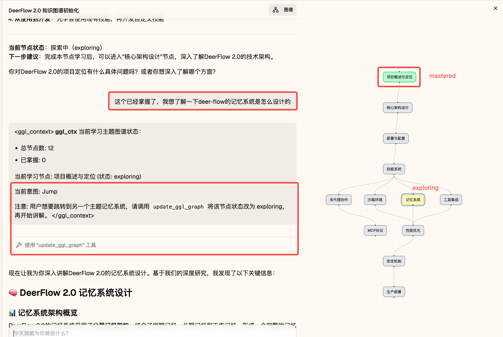
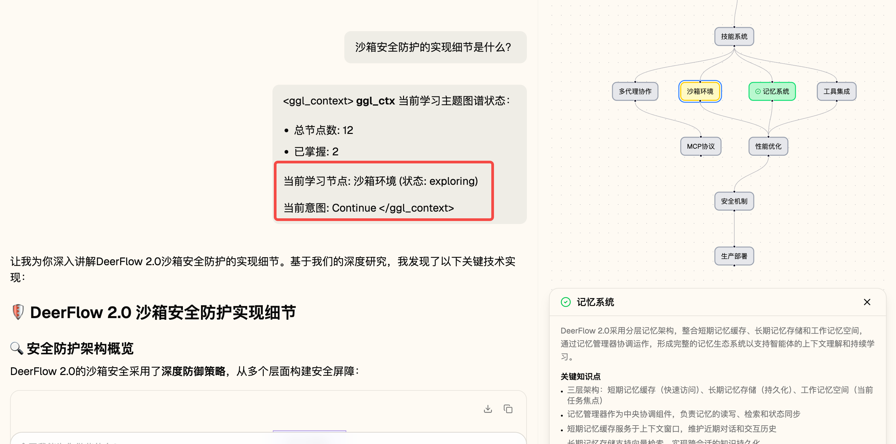
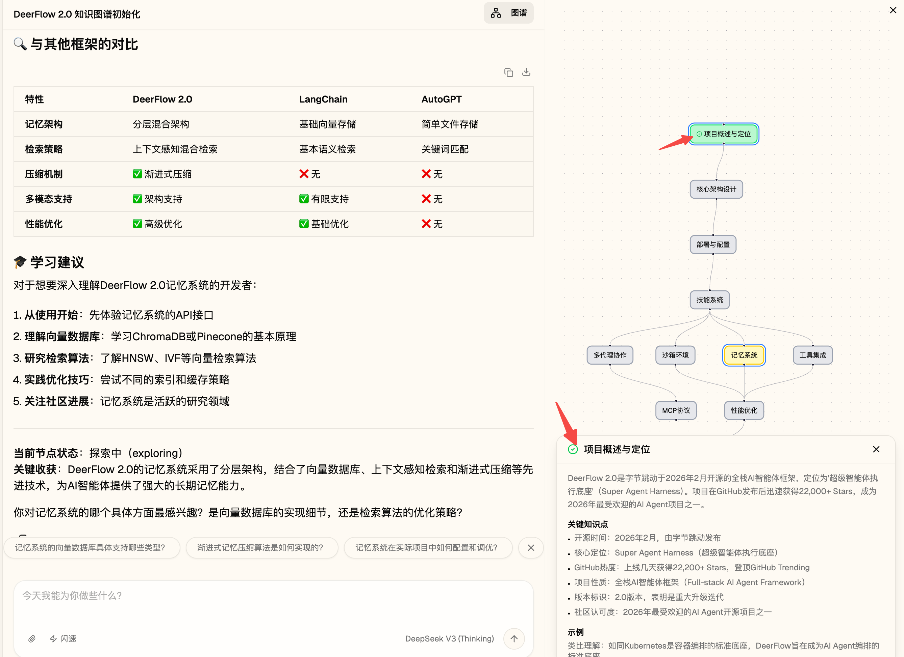
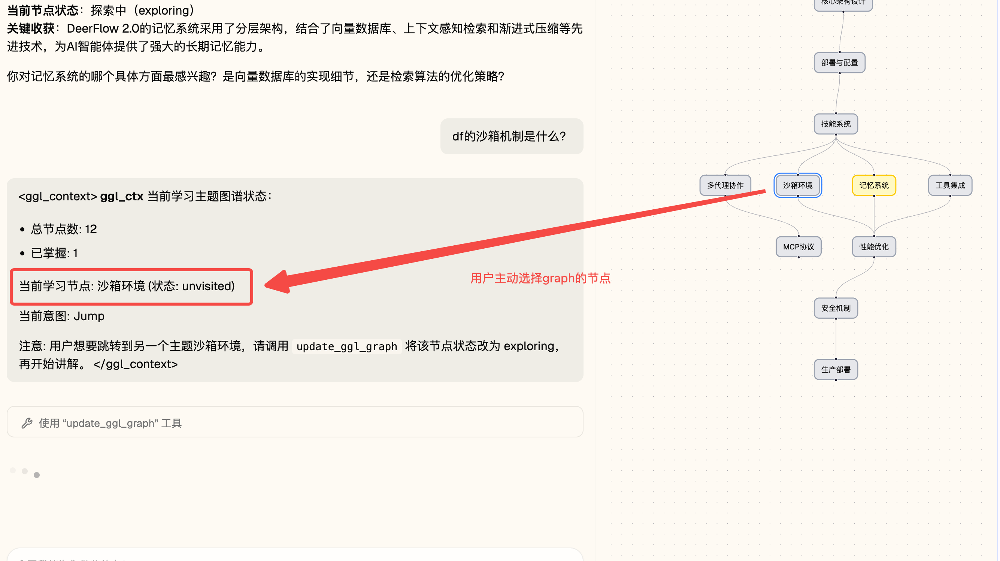

# 🦌 GGL-flow

**Graph Guided Learning** — 基于 Topic Graph 的自适应知识学习 Agent。

> **对话是瞬时的，图谱是永恒的。对话只是修改、补充、遍历图谱的手段。**

---

## 产品概述

GGL 在 DeerFlow 基础上扩展，提供：

- **知识图谱**：Topic Graph 可视化，节点状态（unvisited / exploring / mastered / blurry）
- **学习路径**：按先修关系推荐学习顺序，支持双击切换当前节点
- **知识卡**：节点掌握后异步生成摘要，支持预览与下载
- **脑图布局**：层级化展示，根节点在上、依赖在下

---

- 首次启动session，强制 Subagent 进行 Deep Research 学习主题，初始化知识图谱


- 在与用户新一轮对话中，根据用户反馈调整知识graph，更新知识节点状态



- 判断用户已经掌握当前知识点后，将节点状态设为 mastered，触发知识卡异步生成


- 用户可手动选择要学习的知识图谱节点，下一次会话会带上选中节点的上下文


-

---

## 快速开始

### 环境要求

- Python 3.12+、[uv](https://docs.astral.sh/uv/)
- Node.js 22+、pnpm 10+
- LLM API Key（如 OpenAI、DeepSeek、Anthropic）

### 安装与运行

```bash
# 1. 克隆并进入项目
cd GGL-flow

# 2. 生成配置（首次）
make config

# 3. 安装依赖
make install

# 4. 配置 API Key（编辑 config.yaml 或 .env）
# 5. 启动全部服务
make dev
```

访问 **http://localhost:2026**（Nginx 统一入口）。

### 使用 GGL

1. 新建会话，选择 **GGL** 模式
2. 输入学习主题（如「DeerFlow 知识体系」）
3. AI 会初始化 Topic Graph，并引导按路径学习
4. 双击图谱节点可切换当前学习主题
5. 掌握节点后，知识卡会异步生成，可在 Artifacts 中下载

---

## 架构概览

```
                    Nginx (2026)
                         │
        ┌────────────────┼────────────────┐
        ▼                ▼                ▼
   LangGraph         Gateway          Frontend
   (2024)            (8001)            (3000)
        │                │
        │  ┌────────────┴────────────┐
        │  │ GGL Middleware          │
        │  │ Knowledge Card Queue    │
        │  │ update_ggl_graph 工具   │
        │  └─────────────────────────┘
        ▼
   Checkpoint (thread state)
```

- **LangGraph**：Agent 运行时，含 GGL 中间件与工具
- **Gateway**：REST API（models、threads、GGL graph、artifacts、uploads）
- **Frontend**：Next.js + React Flow 知识图谱

---

## 项目结构

```
GGL-flow/
├── backend/                 # Python 后端
│   ├── src/
│   │   ├── agents/
│   │   │   ├── knowledge_card/   # 知识卡队列与处理器
│   │   │   ├── middlewares/      # 含 GGLMiddleware
│   │   │   └── lead_agent/
│   │   ├── gateway/
│   │   │   ├── checkpoint_utils.py
│   │   │   └── routers/ggl.py
│   │   └── ggl/                  # GGL 工具与意图
│   └── ...
├── frontend/                # Next.js 前端
│   └── src/components/workspace/ggl/  # 知识图谱组件
├── skills/public/ggl-init/  # GGL 初始化 Skill
├── config.yaml              # 主配置
└── .docs/
    └── GGL_MODIFICATIONS.md # 改造说明
```

---

## 常用命令

| 命令 | 说明 |
|------|------|
| `make config` | 生成 config.yaml（首次） |
| `make check` | 检查环境 |
| `make install` | 安装前后端依赖 |
| `make dev` | 启动全部服务（热重载） |
| `make stop` | 停止服务 |

---

## 文档

- [GGL 改造说明](.docs/GGL_MODIFICATIONS.md) — 知识卡异步、脑图布局、subagent 策略等
- [优化待办](.docs/optimization_backlog.md) — 后续优化点
- [Backend README](backend/README.md) — 后端架构与 API
- [Frontend README](frontend/README.md) — 前端开发

---

## License

见 [LICENSE](LICENSE)。
